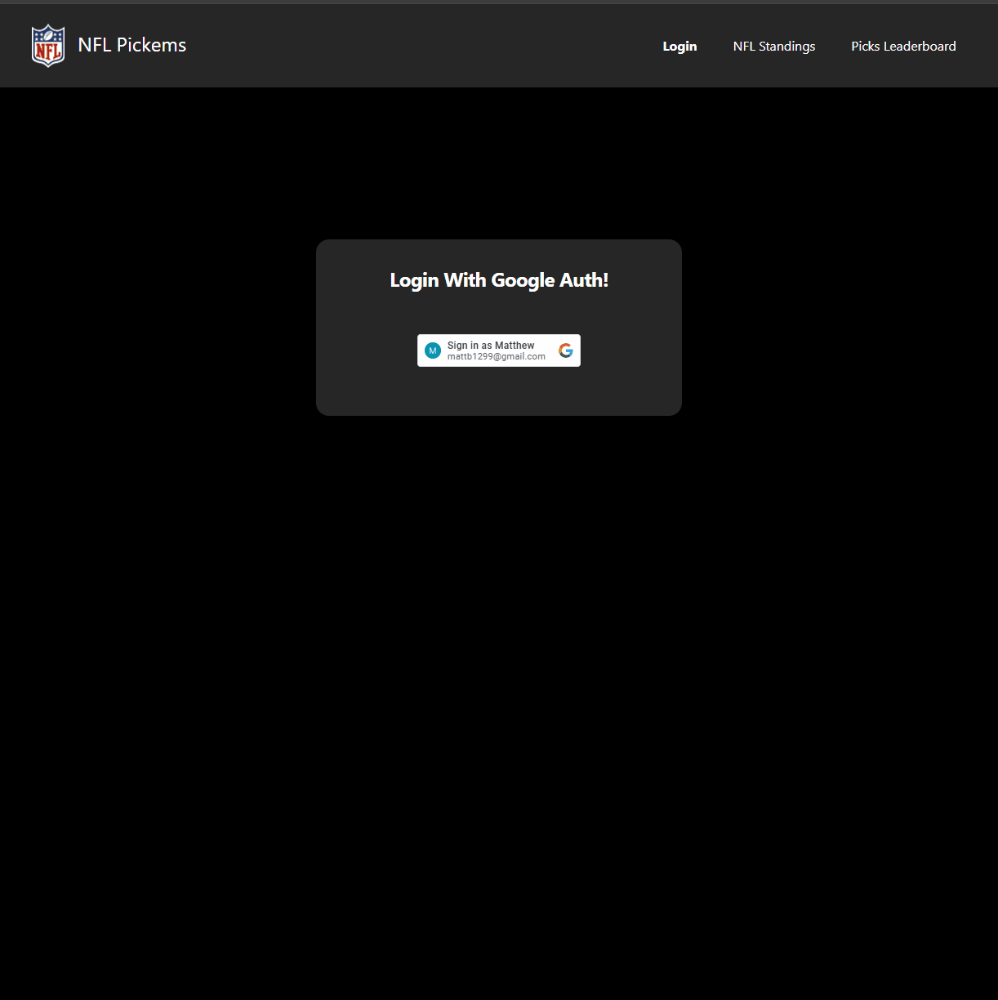

# NFL-Pickems

APPLICATION STATUS: Upgrades Complete sorting out hosting.

### Frontend

Utilized Vue,js Pinia and Tailwind-CSS for state managment

##### Env Variables:
- VITE_GOOGLE_CLIENT_ID
- VITE_API_URL
- VITE_YEAR

##### Local Setup:
- npm Install
- npm run dev

### Golang Backend

Run API Locally:
	go run api/* -db="MongoUriHere"

I Utilized 
	//Health Check Routes
	router.HandlerFunc(http.MethodGet, "/", app.healthcheckHandler)

	//Season Routes
	router.GET("/v1/seasons", app.allSeasonStandings)
	router.GET("/v1/seasons/:year", app.seasonStandings)

	//User Profile
	router.GET("/v1/user", app.getUser)

	//Picks
	router.GET("/v1/get/picks/:year", app.getPicks)
	router.POST("/v1/lockin/picks/:year", app.lockinPicks)

	//Leaderboard
	router.GET("/v1/leaderboard/:year", app.picksStandings)

### Python Scraping
I utilized pythons beautiful soup 

##### Env Variables:
- YEAR
- MONGO_URI